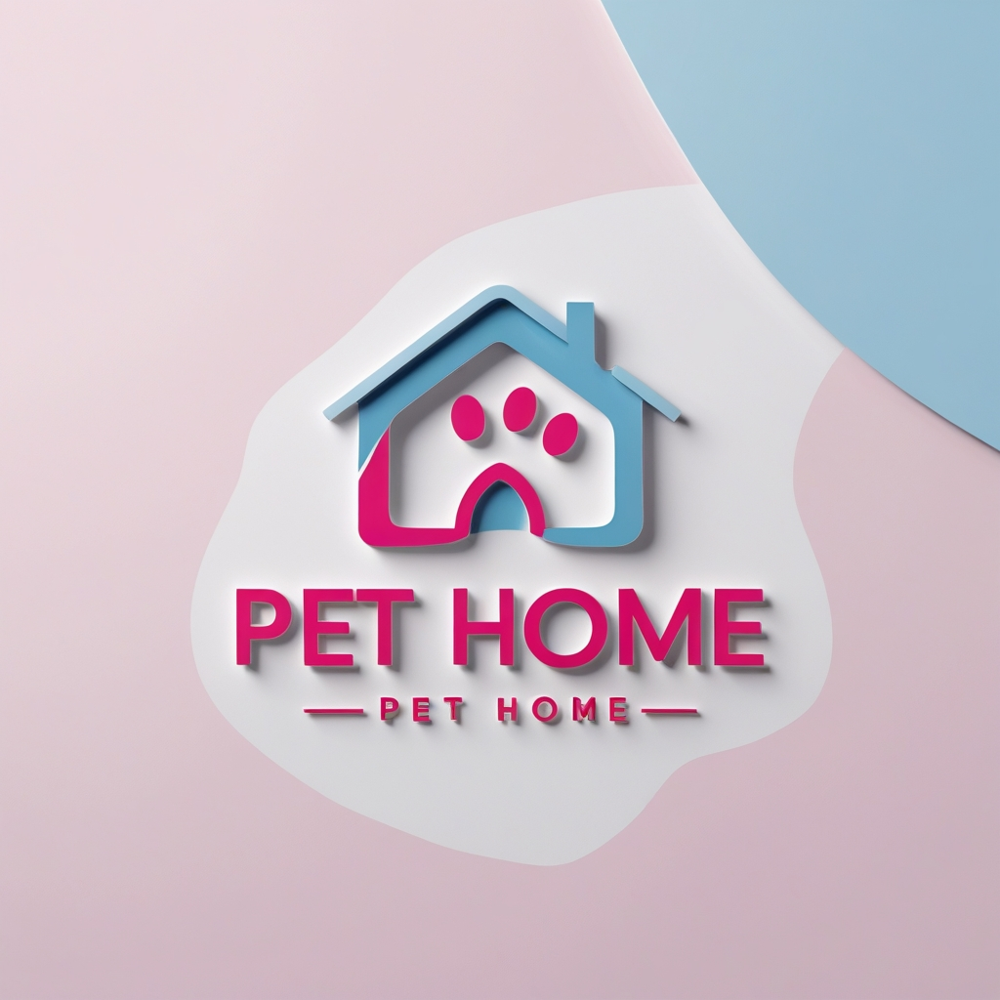

# Pet Home Shop 🐾

Pet Home Shop is a simple pet shop project created using **HTML**, **CSS**, and **JavaScript**. The project features a color theme and an animated poster in its first version. It is designed for desktop view, and a responsive design approach has been used to ensure adaptability.

  <!-- Replace 'path_to_image.jpg' with the actual image path -->
## Created By
This project was created by [Arshiya Mh](https://github.com/arshiya-mh).


## Features ✨
- **Color Theme**: A vibrant and eye-catching theme 🌈.
- **Animated Poster**: A dynamic, animated background to attract users 🎥.
- **Desktop Design**: The project is optimized for desktop use 💻.
- **Simple and Clean UI**: A clean and minimal design with an intuitive interface 🧑‍💻.

## Installation 🛠️

To view or contribute to this project, follow these steps:

1. Clone the repository:
    ```bash
    git clone https://github.com/arshiya-mh/pet-home-shop.git
    ```

2. Navigate into the project folder:
    ```bash
    cd pet-home-shop
    ```

3. Open the `index.html` file in your browser to view the project.

## Technologies Used 🔧
- **HTML**: Markup language used to structure the content 📝.
- **CSS**: Styling language for designing the layout and theme 🎨.
- **JavaScript**: Used for interactivity and animations ⚡.

## Future Updates 🔮
- **Mobile Responsiveness**: Plans to add mobile responsiveness for better accessibility 📱.
- **Additional Features**: Possible addition of shopping cart functionality, user reviews, and payment integration 💳.
